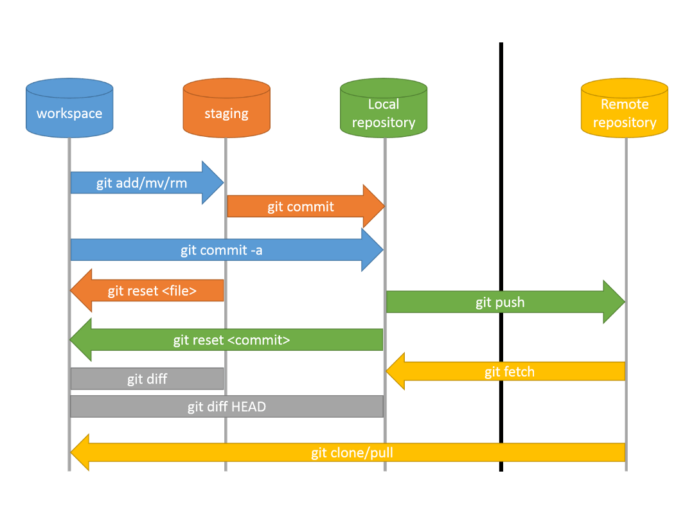

# Hello GIT

- [how git work](https://youtu.be/e9lnsKot_SQ)
- [Git & GitHub Fundamentals In Depth](https://youtu.be/DVRQoVRzMIY)




## git command to know

- git clone
- git status
- git add
- git commit
- git pull
- git push
- git switch -b
- git log --oneline

### git clone
Download remote repository

```bash
git clone <repo_url>
```

### git pull
```
git fetch
+ 
git merge
```

**Step 1 — fetch**  
Downloads the latest commits from the remote repository
(but does NOT change your local files yet)

**Step 2 — merge**
Merges those downloaded commits into your current branch

- get the last commits from remote
```bash
git pull origin master
```