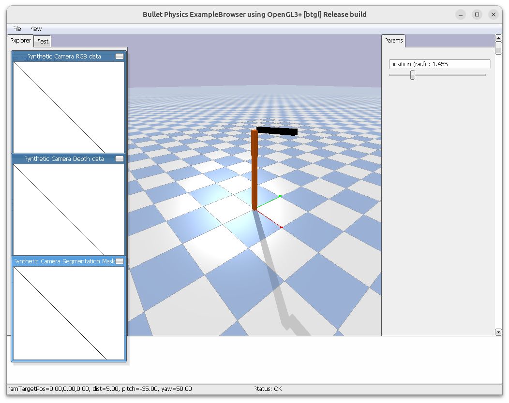
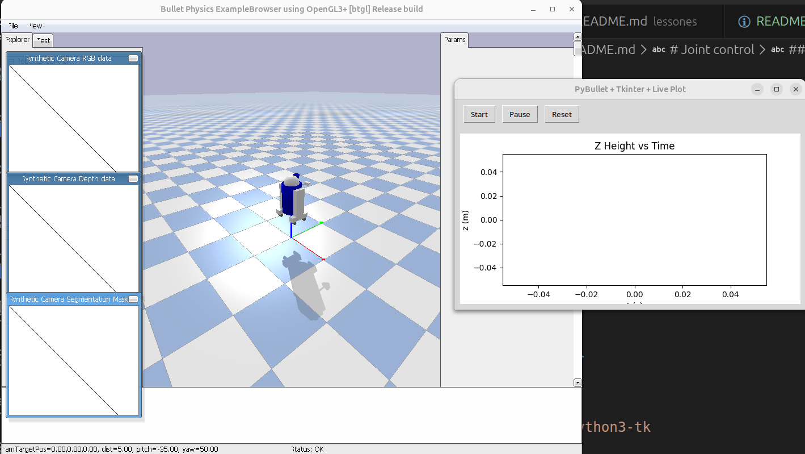
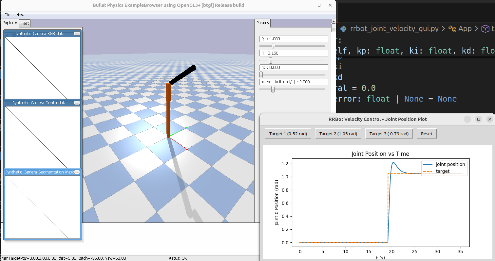
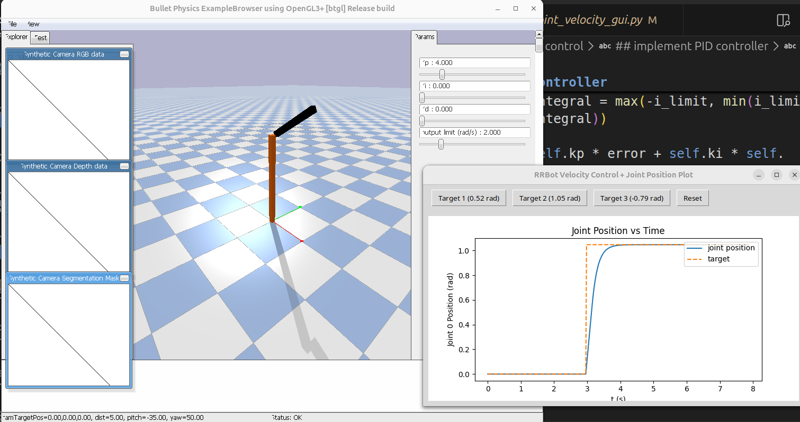

# Joint control

## Read joint info

- getJointState
- getNumJoints

### getNumJoints
> [!NOTE]
> PyBullet quickstart guide page 22

Return the number of joint in the robot

|   |   |   |   |
|---|---|---|---|
| required  | bodyUniqueId  | int  | the body unique id, as returned by loadURDF etc.  |
| optional  | physicsClientId  | int  | if you are connected to multiple servers, you can pick one.  |

```python
robot = p.loadURDF("rrbot.urdf", basePosition=[0, 0, 0.5], useFixedBase=True)
num_joints = p.getNumJoints(robot)
```

### getJointState

Retrun joint position, velocity, joint reaction forces and joint motor torque.

> [!NOTE]
> PyBullet quickstart guide page 28


|   |   |   |   |
|---|---|---|---|
| required  | bodyUniqueId  | int  | the body unique id, as returned by loadURDF etc.  |
| required  | jointIndex  | int  | link index in range [0..getNumJoints(bodyUniqueId)]  |
| required  | physicsClientId  | int  | if you are connected to multiple servers, you can pick one.  |


#### Output

| Index | Name                      | Type             | Description                                                         |
| ----- | ------------------------- | ---------------- | ------------------------------------------------------------------- |
| 0     | `jointPosition`           | float            | Current joint position (radians for revolute, meters for prismatic) |
| 1     | `jointVelocity`           | float            | Current joint velocity (rad/s or m/s)                               |
| 2     | `jointReactionForces`     | tuple (6 floats) | Reaction forces at joint (Fx, Fy, Fz, Mx, My, Mz)                   |
| 3     | `appliedJointMotorTorque` | float            | Motor torque applied during last step                               |


> [!NOTE]
> ## Exercise 3_1
> Move the link using `setJointMotorControl2` method and read the joint position using `getJointState`


---

## Position control

```python
import pybullet as p
import pybullet_data
import time
import os
import math

# setup
p.connect(p.GUI)
p.resetSimulation() # type: ignore
p.setGravity(gravX=0, gravY=0, gravZ=-9.8)
p.setAdditionalSearchPath(path=pybullet_data.getDataPath())
plane = p.loadURDF("plane.urdf")

# add current file location and its 'urdf' subfolder to search paths
cwd = os.path.dirname(os.path.abspath(__file__))
p.setAdditionalSearchPath(cwd)
# load URDF

robot = p.loadURDF("rrbot.urdf", basePosition=[0, 0, 0.5], useFixedBase=True)
# set link2 (joint index 1) to 45 degrees using position control
p.setJointMotorControl2(robot, 0, p.POSITION_CONTROL, targetPosition=math.pi/4, force=200)

p.setRealTimeSimulation(True)
try:
    while True:
        keys = p.getKeyboardEvents()

        # 27 = ESC
        if 27 in keys and keys[27] & p.KEY_WAS_TRIGGERED:
            print("ESC pressed, exiting...")
            break

        time.sleep(1/240)

finally:
    p.disconnect()

```

**Download code**

- [rrbot-joint-position.py](code/rrbot-joint-position.py)
- [urdf](code/rrbot.urdf)

---

> [!NOTE]
> ### Exercise 3_2
> Add `addUserDebugParameter` parameter slider to control joint position




[solution](solution/2_set_position/rrbot-joint-position.py)

---

## Velocity control

Control position using velocity control

```python
p.setJointMotorControl2(
        bodyIndex=robot,
        jointIndex=JOINT_INDEX,
        controlMode=p.VELOCITY_CONTROL,
        targetVelocity=target_velocity,
        force=MAX_FORCE,
    )
```

read to joint position compute the error between target and current position 
set the desire velocity , use `kp` as a factor. this is `P` controller

```python
import logging
import math
import os
import time

import pybullet_data
import structlog

import pybullet as p

JOINT_INDEX = 0
TIME_STEP = 1.0 / 240.0
MAX_FORCE = 200.0

logging.basicConfig(level=logging.INFO, format="%(message)s")

structlog.configure(
    processors=[
        structlog.processors.add_log_level,
        structlog.processors.TimeStamper(fmt="iso"),
        structlog.dev.ConsoleRenderer(),  # <-- colored output
    ],
    logger_factory=structlog.stdlib.LoggerFactory(),
)

log = structlog.get_logger()

# setup
physicsClient = p.connect(p.GUI)
p.resetSimulation()  # type: ignore
p.setGravity(gravX=0, gravY=0, gravZ=-9.8)
p.setAdditionalSearchPath(path=pybullet_data.getDataPath())
plane = p.loadURDF("plane.urdf")


# add current file location and its 'urdf' subfolder to search paths
cwd = os.path.dirname(os.path.abspath(__file__))
p.setAdditionalSearchPath(os.path.join(cwd, "urdf"))
# load URDF
robot = p.loadURDF("rrbot.urdf", basePosition=[0, 0, 0.5], useFixedBase=True)

# declare parameters for outer-loop position tracking with velocity command
pose_param_id = p.addUserDebugParameter(
    "target position (rad)", -math.pi, math.pi, 0.0, physicsClient
)
kp_param_id = p.addUserDebugParameter(
    "Kp (rad/s per rad error)", 0.0, 20.0, 4.0, physicsClient
)
max_vel_param_id = p.addUserDebugParameter(
    "max velocity (rad/s)", 0.1, 10.0, 2.0, physicsClient
)

p.setTimeStep(TIME_STEP)
p.setRealTimeSimulation(False)

try:
    while True:
        target_pos = p.readUserDebugParameter(pose_param_id)
        kp = p.readUserDebugParameter(kp_param_id)
        max_velocity = p.readUserDebugParameter(max_vel_param_id)

        js = p.getJointState(robot, JOINT_INDEX)
        current_pos = js[0]
        pos_error = target_pos - current_pos

        # Outer-loop P controller: position error -> target velocity
        target_velocity = kp * pos_error
        target_velocity = max(-max_velocity, min(max_velocity, target_velocity))

        p.setJointMotorControl2(
            bodyIndex=robot,
            jointIndex=JOINT_INDEX,
            controlMode=p.VELOCITY_CONTROL,
            targetVelocity=target_velocity,
            force=MAX_FORCE,
        )

        p.stepSimulation()
        keys = p.getKeyboardEvents()
        joint_velocity = p.getJointState(robot, JOINT_INDEX)[1]
        log.info(
            "joint_tracking",
            joint=JOINT_INDEX,
            target_position_rad=target_pos,
            current_position_rad=current_pos,
            position_error_rad=pos_error,
            commanded_velocity_rad_s=target_velocity,
            measured_velocity_rad_s=joint_velocity,
        )

        # 27 = ESC
        if 27 in keys and keys[27] & p.KEY_WAS_TRIGGERED:
            print("ESC pressed, exiting...")
            break

        time.sleep(TIME_STEP)

finally:
    p.disconnect()
```

---

## Effort controller

### PID
[PID Control - A brief introduction](https://youtu.be/UR0hOmjaHp0)

> [!NOTE]
> ## Exercise 3_3 
> Convert the velocity controller to effort controller
> use:
> - addUserDebugParameter: control the desire variable (target, p, d, max torque)
> - add PD controller

[solution](solution/3_set_effort/rrbot-joint-effort.py)

---

## Add more control

```bash
sudo apt update
sudo apt install python3-tk
```

```bash
pip install matplotlib
```

[check simple gui](code/tk_inter_demo.py)



---

## Let's do some graph

```bash
pip install matplotlib
```

[matplotlib intro ()](https://youtu.be/2KY5AaFvWtE?list=PLZPZq0r_RZONpa_Xg1MmyjmctJjL4l3Ay)

### Demo
using the velocity control demo

- input target step as error
- plot the output position to graph
- reset the simulation

[demo plot the position graph over time](code/rrbot_joint_velocity_gui.py)

---

## implement PID controller

```python
class PIDController:
    def __init__(self, kp: float, ki: float, kd: float) -> None:
        self.kp = kp
        self.ki = ki
        self.kd = kd
        self.integral = 0.0
        self.prev_error: float | None = None

    def set_gains(self, kp: float, ki: float, kd: float) -> None:
        self.kp = kp
        self.ki = ki
        self.kd = kd

    def reset(self) -> None:
        self.integral = 0.0
        self.prev_error = None

    def compute(self, target: float, measurement: float, dt: float, output_limit: float) -> float:
        error = target - measurement
        derivative = 0.0 if self.prev_error is None else (error - self.prev_error) / dt

        # Integrator with simple anti-windup clamp tied to output limit.
        self.integral += error * dt
        if self.ki > 1e-9:
            i_limit = output_limit / self.ki
            self.integral = max(-i_limit, min(i_limit, self.integral))

        output = self.kp * error + self.ki * self.integral + self.kd * derivative
        output = max(-output_limit, min(output_limit, output))
        self.prev_error = error
        return output
```

[full sample code](code/rrbot_joint_velocity_gui.py)

> [!NOTE]
> ### Exercise 3_4
> Play with pid gains and check the system response time and output

#### PI control


#### P control
