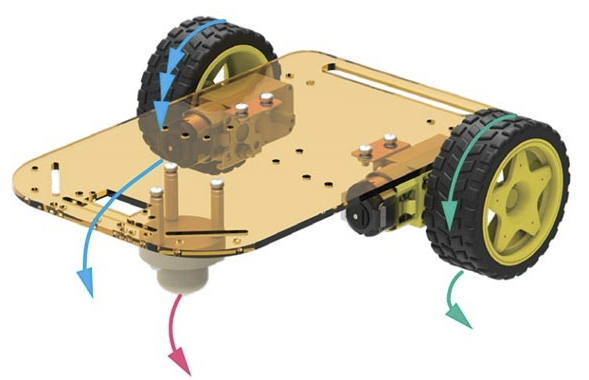
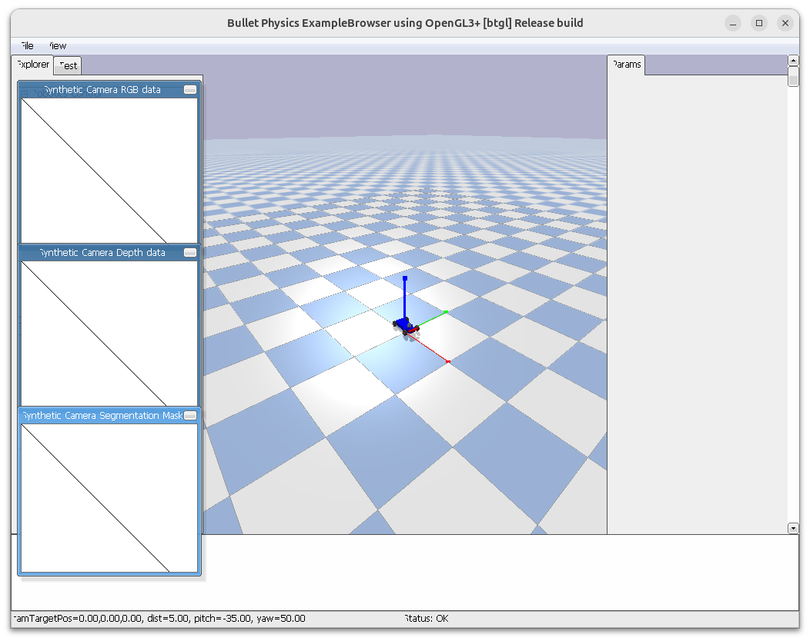

# Diff driver

A differential drive robot:

- Has two independently driven wheels
- Wheels are mounted on the same axis
- Usually has a passive caster
- It only moves along its forward axis.

## Robot Model
Define:

- r = wheel radius
- b = distance between wheels (track width)
- ωL,ωR = wheel angular velocities
- v = linear velocity of robot center
- ω = yaw rate

Robot pose in world:

$$(x, y, \theta)$$

## Robot movement

- $$\omega_L = \omega_R$$ : Robot move straight
- $$\omega_L = -\omega_R$$: Robot rotate in place

---

### Wheel velocity
Each wheel linear velocity

$$v_L = r \omega_L$$
$$v_R = r \omega_R$$

**Linear velocity of robot center**

$$v = \frac{v_R + v_L}{2}$$

**Angular velocity**
$$\omega = \frac{v_R - v_L}{b}$$

---

### Inverse Kinematics
Given desired $$(v, \omega)$$

We compute wheel speed

$$\omega_R = \frac{1}{r}\left(v + \frac{b}{2}\omega\right)$$

$$\omega_L = \frac{1}{r}\left(v - \frac{b}{2}\omega\right)$$

---

> [!NOTE]
> ### Exercises 5_1
> Create diff robot simulation
> use racer robot
> try to move the robot in square, rotate 
> the racer car is not true diff drive , its ackermann steering like normal car
> we keep the front wheel (steering) at position zero and give velocity command to left and right wheels

[solution](solution/5_1_diff_robot/racer.py)