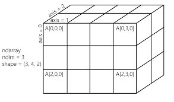

# numpy

NumPy (Numerical Python) is the core numerical computing library in Python.
It provides a fast and efficient way to work with:

- Multi-dimensional arrays
- Linear algebra
- Mathematical functions
- Random numbers
- Scientific computing

## ndarray
the main object in numpy is a **ndarray** (n-dimensional array)

```python
import numpy as np

a = np.array([1, 2, 3])
print(a)
```

### 2d array (matrix)

```python
import numpy as np

a = np.array([
    [1, 2],
    [3, 4]
])

print(a)

```

### 3d array (Tensor)

```python
import numpy as np


a = np.zeros((2, 3, 4))
print(a)
```



---

