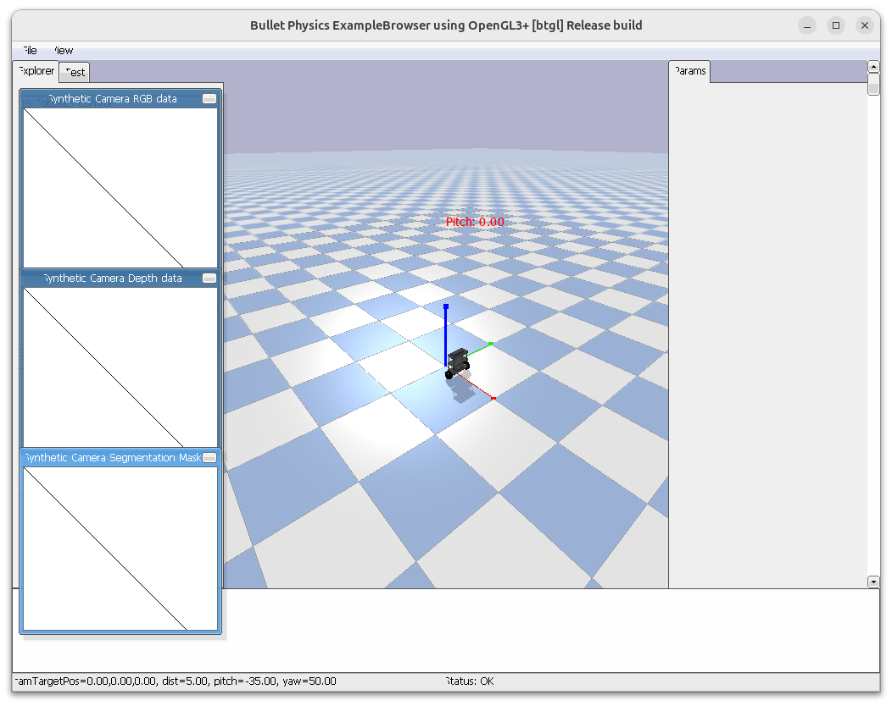

# self balancer

Control the balancer using PID controller that get the robot Pitch and output torque to motors

[code](code/self_balancer_pid.py)

> [!NOTE]
> ### Exercise 8_1
> Convert the pid controller implementation to our implementation from lesson 3