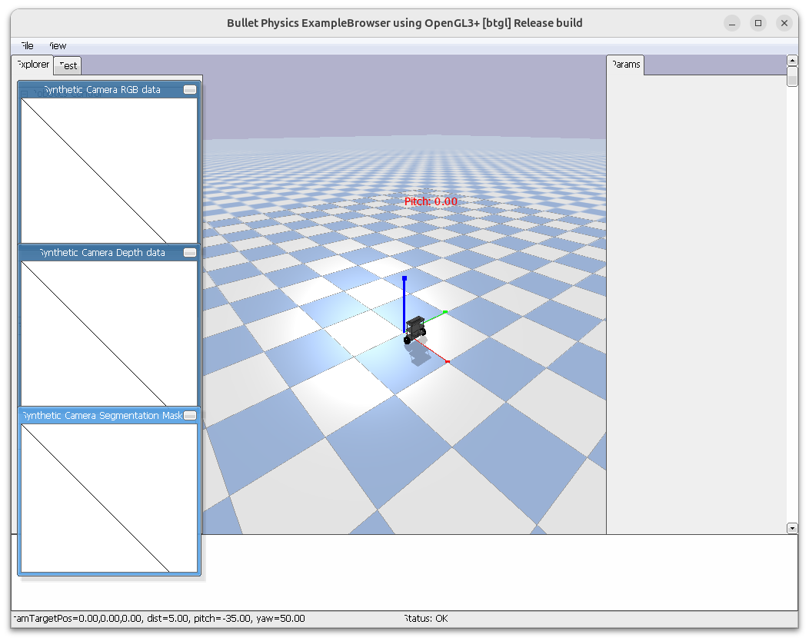

# self balancer

Control the balancer using PID controller that get the robot Pitch and output torque to motors

[code](code/self_balancer_pid.py)



## Control hierarchy

The self-balancing robot should be controlled with small loops that each have one job.

### Pitch stabilization

Pitch stabilization is the inner and most important loop. It reads the robot pitch angle from the base orientation:

```python
pitch = p.getEulerFromQuaternion(
    p.getBasePositionAndOrientation(robot, id)[1]
)[1]
```

The pitch PID compares `pitch_setpoint` with the current `pitch` and outputs the wheel torque needed to keep the robot upright. When the robot only balances in place, the pitch setpoint is usually `0`.

```text
pitch_setpoint -> pitch PID -> wheel torque
```

### Position control

Position control is an outer loop. It should not command the motors directly. Instead, it reads the robot position and outputs a desired pitch angle for the pitch controller.

Read the robot x position from PyBullet:

```python
position = p.getBasePositionAndOrientation(robot, id)[0][0]
```

The position loop is:

```text
position_setpoint -> position PID -> pitch_setpoint -> pitch PID -> wheel torque
```

For example, if the robot is too far forward, the position PID asks the robot to lean backward a little. Limit this output so the position controller cannot request an unsafe pitch angle.

```python
pitch_setpoint = max(-MAX_PITCH_SETPOINT, min(MAX_PITCH_SETPOINT, pitch_setpoint))
```

### Yaw control

Yaw control is another loop that controls the robot heading. It reads yaw from the same base orientation:

```python
yaw = p.getEulerFromQuaternion(
    p.getBasePositionAndOrientation(robot, id)[1]
)[2]
```

Yaw should be mixed into the left and right wheel torques. It does not replace the pitch controller and it should not set the pitch setpoint.

```text
yaw_setpoint -> yaw PID -> turn correction
```

Then combine balance torque and yaw correction:

```python
left_torque = balance_torque + yaw_correction
right_torque = -balance_torque + yaw_correction
```

Depending on the wheel direction convention in the URDF, one yaw sign may need to be flipped.

## PlotJuggler telemetry

PlotJuggler is useful for PID tuning because it lets you plot controller setpoints and feedback signals live. One simple standalone option is to open PlotJuggler's UDP server and send JSON packets from the PyBullet simulation.

Create a small UDP client:

```python
import json
import socket

plotjuggler_socket = socket.socket(socket.AF_INET, socket.SOCK_DGRAM)
plotjuggler_address = ("127.0.0.1", 9870)
```

Send controller data each simulation step:

```python
data = {
    "time": time.time(),
    "position/setpoint": position_setpoint,
    "position/feedback": position,
    "pitch/setpoint": pitch_setpoint,
    "pitch/feedback": pitch,
}

plotjuggler_socket.sendto(
    json.dumps(data).encode("utf-8"),
    plotjuggler_address,
)
```

In PlotJuggler, start the UDP streaming server on the same port, then plot the setpoint and feedback signals together. Good first plots are:

- `position/setpoint` with `position/feedback`
- `pitch/setpoint` with `pitch/feedback`
- pitch in degrees if you also send converted degree values

> [!NOTE]
> ### Exercise 8_1
> Convert the pid controller implementation to our implementation from lesson 3


> [!NOTE]
> ### Exercise 8_2
> Install plotjuggler and watch [ PlotJuggler: The Best Time Series Visualization Tool for ROS ](https://youtu.be/9kFRecDU1bg)


> [!NOTE]
> ### Exercise 8_3
> 1. UDP, learn in brief what is udp network and what the different between udp and tcp
> 2. write simple client server udp networking using python


> [!NOTE]
> ### Exercise 8_4
> 1. understand JSON format
> 2. generate random data send it using JSON and view it using plotjuggler 


> [!NOTE]
> ### Exercise 8_5
> 1. Config the PID's using graph
> 2. send pitch and pitch setpoint as json data and calibrate the PID gain


> [!NOTE]
> ### Exercise 8_6
> 1. Config the PID's using graph
> 2. send yaw and yaw setpoint as json data and calibrate the PID gain

> [!NOTE]
> ### Exercise 8_7
> 1. Config the PID's using graph
> 2. send pos and pos setpoint as json data and calibrate the PID gain
