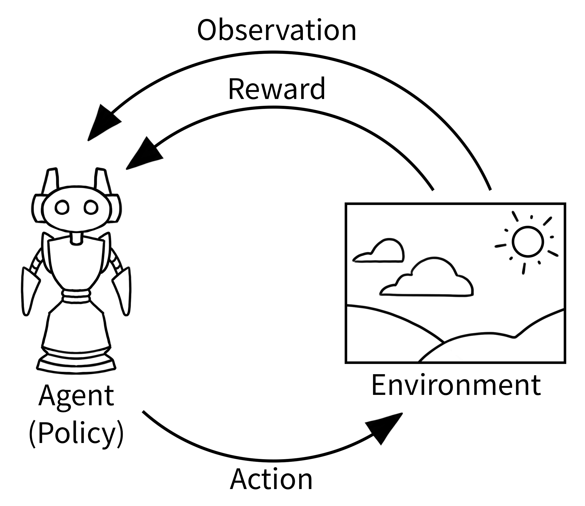

# Control using RL

## GYM

```
pip install gymnasium
```

```
pip install stable-baselines3[extra]
```

### Gym environment
[GYM Basic Usage](https://gymnasium.farama.org/introduction/basic_usage/)

In reinforcement learning, the classic “agent-environment loop” pictured below represents how learning happens in RL. It’s simpler than it might first appear:

1. Agent observes the current situation (like looking at a game screen)
2. Agent chooses an action based on what it sees (like pressing a button)
3. Environment responds with a new situation and a reward (game state changes, score updates)
4. Repeat until the episode ends





### Lessens

- [Q-learning](q_learning/)
- [frozen lake](frozen_lake/)
- [cliff (ppo)](cliff/)
- [cart_pole](cart_pole/)
- [warehouse]()
- [custom environment](custom_environment/)
- [bullet custom environment](bullet/)
- [self balancer]()
- [stable baseline](stable_baseline/)

---

## Reference
- [Reinforcement Learning on Self-balancing Bot](https://youtu.be/bIlwKK_iKKw)
- [How to create a custom environment for Reinforcement Learning (using Gymnasium API and PyBullet)](https://youtu.be/H2uUvhSKpWI)
- [ Balancebot learns to roll around through Reinforcement Learning ](https://youtu.be/NpfKzm2LS7w)
- [to check](https://www.youtube.com/playlist?list=PLbMO9c_jUD47r9QZKpLn5CY_Mt-NFY8cC)