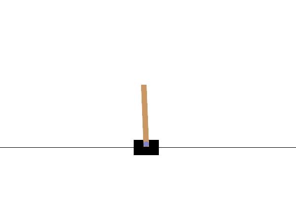

# Cart pole

- [gymnasium cart pole](https://gymnasium.farama.org/environments/classic_control/cart_pole/)


## install
```bash
pip install gymnasium[classic-control]
```

## details
- **State Space**: At every step you get 4 values:
    - Cart position (-4.8 to 4.8 units)
    - Cart velocity (negative or positive)
    - Pole angle (-12° to 12°)
    - Pole angular velocity (how fast it is tilting)

- **Action Space**: There are two actions — 0 (left push) or 1 (right push).
- **Reward**: At every step when the pole remains balanced, you get +1 reward.
- **Termination**: If the angle of the pole is more than ±12° or the cart crosses the boundary of ±2.4 units, then the episode ends.

---

## PID

[view code](code/cart_pid.py)

---

## Lets do RL 

### Random action
```python
import gymnasium as gym

env = gym.make("CartPole-v1", render_mode="human")
obs, info = env.reset(seed=42)
print("Initial observation:", obs)

env.render()
for _ in range(10):
    action = env.action_space.sample()  # Random action
    obs, reward, terminated, truncated, info = env.step(action)
    print(f"Action: {action}, Observation: {obs}, Reward: {reward}")
    env.render()
    if terminated or truncated:
        print("Episode finished. Resetting environment.")
        obs, info = env.reset()
env.close()
```

[code](code/gym_cart.py)

---

### Q-learning
Code and video base on [Johnny Code](https://www.youtube.com/@johnnycode)


[q-learning](code/cartpole_q.py)

- Run training mode

```python
run(is_training=True, render=False)
```

- Run 
```python
run(is_training=False, render=True)
```

!!! info ""
    
---

## Reference
- [CartPole in OpenAI Gym: The Unexpected RL Breakthrough You Didn’t See Coming](https://medium.com/@rizvaanpatel/cartpole-in-openai-gym-the-unexpected-rl-breakthrough-you-didnt-see-coming-65adf46ec633)
- [Introduction to OpenAI Gym (Gymnasium): Cart-Pole Environment - Reinforcement Learning Tutorial](https://youtu.be/2sp_eucoX2I)
    - [post](https://aleksandarhaber.com/cart-pole-control-environment-in-openai-gym-gymnasium-introduction-to-openai-gym/)
- [ Detailed Explanation and Python Implementation of Q-Learning Algorithm in OpenAI Gym (Cart-Pole) ](https://youtu.be/KMjQmG5Uzis?list=PLO89phzZmnHjYXlCNR_y2qF0gr9x8YpC8)