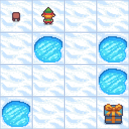

# Frozen lake

[gymnasium](https://gymnasium.farama.org/environments/toy_text/frozen_lake/)


|   |   |
|---|---|
| Action Space  | Discrete(4)  |
| Observation Space  | Discrete(16)  |
| Rewards | - Reach goal: +1 - hole: 0 - frozen: 0 |


	
```python
gymnasium.make("FrozenLake-v1")
```